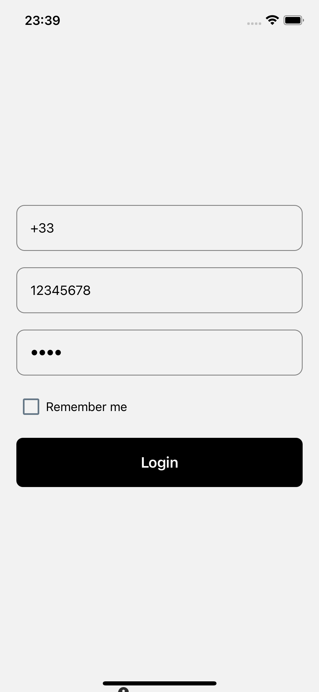
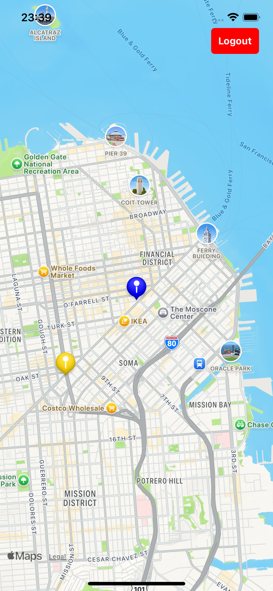
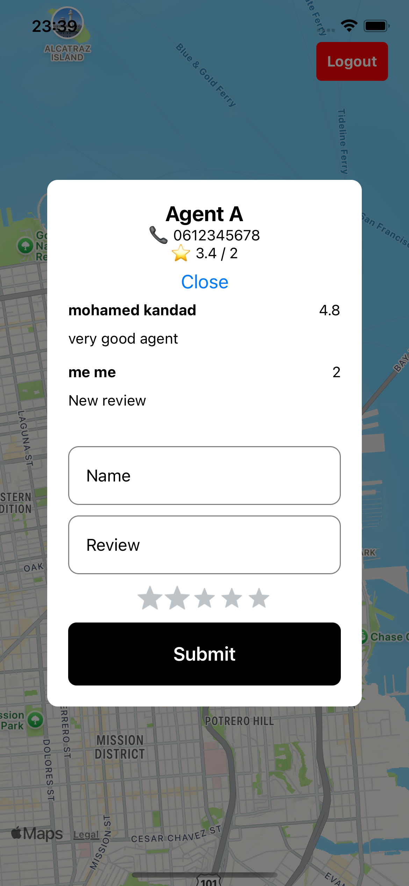

# Test Technique - Développeur React Native Junior

Ce dépôt contient le projet de test technique pour la position de Développeur React Native Junior.

## 🎯 Objectifs du Test

1. Créer une application mobile avec React Native & Expo
2. Utiliser TypeScript pour le typage des composants et des actions Redux
3. Gérer l'état global avec Redux (Redux Toolkit recommandé)
4. Utiliser react-native-extended-stylesheet pour le styling
5. Manipuler Google Maps et la géolocalisation (expo-location, react-native-maps)
6. Gérer la navigation entre écrans avec React Navigation
7. Écrire des tests unitaires simples avec jest-expo (optionnel mais apprécié)

## 🛠 Stack Technique

- **Langage**: TypeScript (obligatoire)
- **État global**: Redux avec Redux Toolkit
- **Navigation**: React Navigation (Stack.Navigator)
- **Style**: react-native-extended-stylesheet
- **Maps**: react-native-maps
- **Géolocalisation**: expo-location
- **Gestion du stockage local**: AsyncStorage
- **Tests unitaires** (optionnel mais apprécié): jest-expo
- **Validation des formulaires**: Formik + Yup

## 📱 Aperçu du Projet

### Screenshots





## 📂 Structure du Projet

```
/src
  /components      -> Composants réutilisables (Button, Input, Card, etc.)
  /features        -> Redux slices (authSlice, mapSlice, etc.)
  /navigations     -> Gestion des écrans (Stack, etc.)
  /pages           -> Écrans (Login, Map)
  /services        -> Gestion des données (mock)
  /store           -> Configuration du Redux Store
  /styles          -> Fichiers react-native-extended-stylesheet
  /tests           -> Tests unitaires (optionnel)
  /utils           -> Fonctions utilitaires (helpers)
  App.tsx          -> Point d'entrée principal
  index.tsx        -> Montage de l'application
/assets
  /screenshots     -> Images d'aperçu de l'application
  /videos          -> Vidéos de démonstration
  /icons           -> Icônes personnalisées de l'application
  /animations      -> Fichiers d'animation (Lottie)
```

## 📌 Contraintes Techniques

1. Utiliser Redux + Redux Toolkit pour la gestion de l'état global
2. Utiliser TypeScript avec des types stricts (interface, type, Enum)
3. Stocker l'état d'authentification avec Redux + AsyncStorage
4. Utiliser FlatList pour afficher les commentaires
5. Respecter la séparation des responsabilités (éviter le code spaghetti)

## 🚀 Installation et Démarrage

1. Cloner le dépôt

   ```bash
   git clone <repo-url>
   cd <repo-name>
   ```

2. Installer les dépendances

   ```bash
   npm install
   # ou
   yarn install
   ```

3. Démarrer l'application
   ```bash
   expo start
   # ou
   npm start
   # ou
   yarn start
   ```

## 📚 Ressources Utiles

- [Documentation React Native](https://reactnative.dev/docs/getting-started)
- [Documentation Expo](https://docs.expo.dev/)
- [Documentation Redux Toolkit](https://redux-toolkit.js.org/)
- [Documentation React Navigation](https://reactnavigation.org/)
- [Documentation TypeScript](https://www.typescriptlang.org/docs/)
- [Documentation Formik](https://formik.org/docs/overview)
- [Documentation Yup](https://github.com/jquense/yup)
- [Documentation Google Maps Platform](https://developers.google.com/maps/documentation)
- [Documentation Expo Location](https://docs.expo.dev/versions/latest/sdk/location/)
